# Design patterns
This repository contains a collection of design patterns implemented in java

## Creational patterns 
### los patrones de creación se centran en la forma de crear objetos y cómo estos objetos se relacionan entre sí y con el entorno.
* [Abstract Factory]
  * proporciona una interfaz para crear familias de objetos relacionados o dependientes sin especificar sus clases concretas.
  * un caso de uso común de este patrón es cuando una aplicación debe crear una familia de objetos relacionados, pero no sabe de antemano qué clases concretas necesitará.
  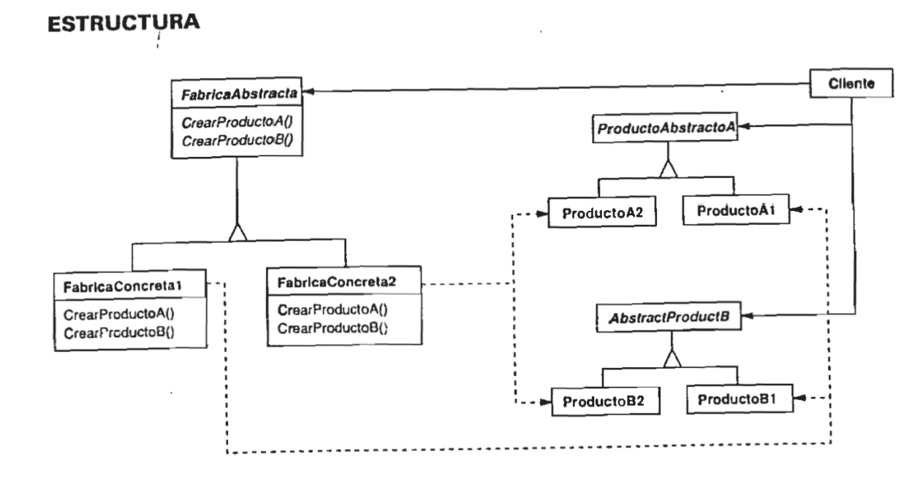
* [Builder]
  * separa la construcción de un objeto complejo de su representación para que el mismo proceso de construcción pueda crear diferentes representaciones.
  * un caso de uso común de este patrón es cuando un algoritmo debe crear diferentes representaciones de un objeto, dependiendo de cómo se construya el objeto.
  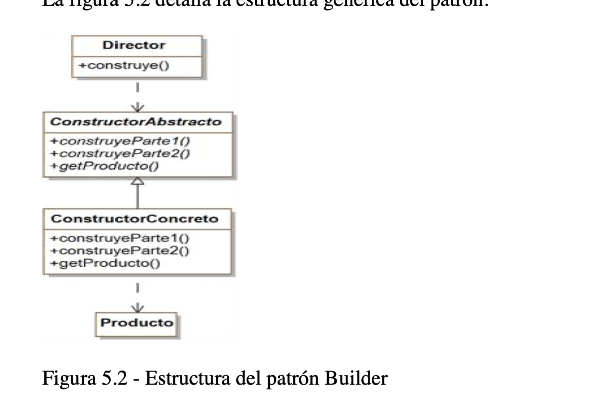
* [Factory Method]
  * define una interfaz para crear un objeto, pero deja a las subclases decidir qué clase instanciar. Factory Method permite que una clase delegue la instancianciación a subclases.
  * un caso de uso común de este patrón es cuando una clase no puede anticipar la clase de los objetos que debe crear.
  * 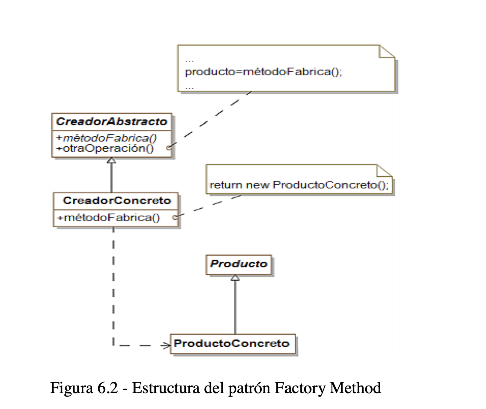
* [Prototype]
  * especifica los tipos de objetos a crear usando una instancia prototípica y crea nuevos objetos copiando este prototipo.
  * un caso de uso común de este patrón es cuando la instancia de la clase a crear es demasiado compleja o costosa para ser clonada.
  * 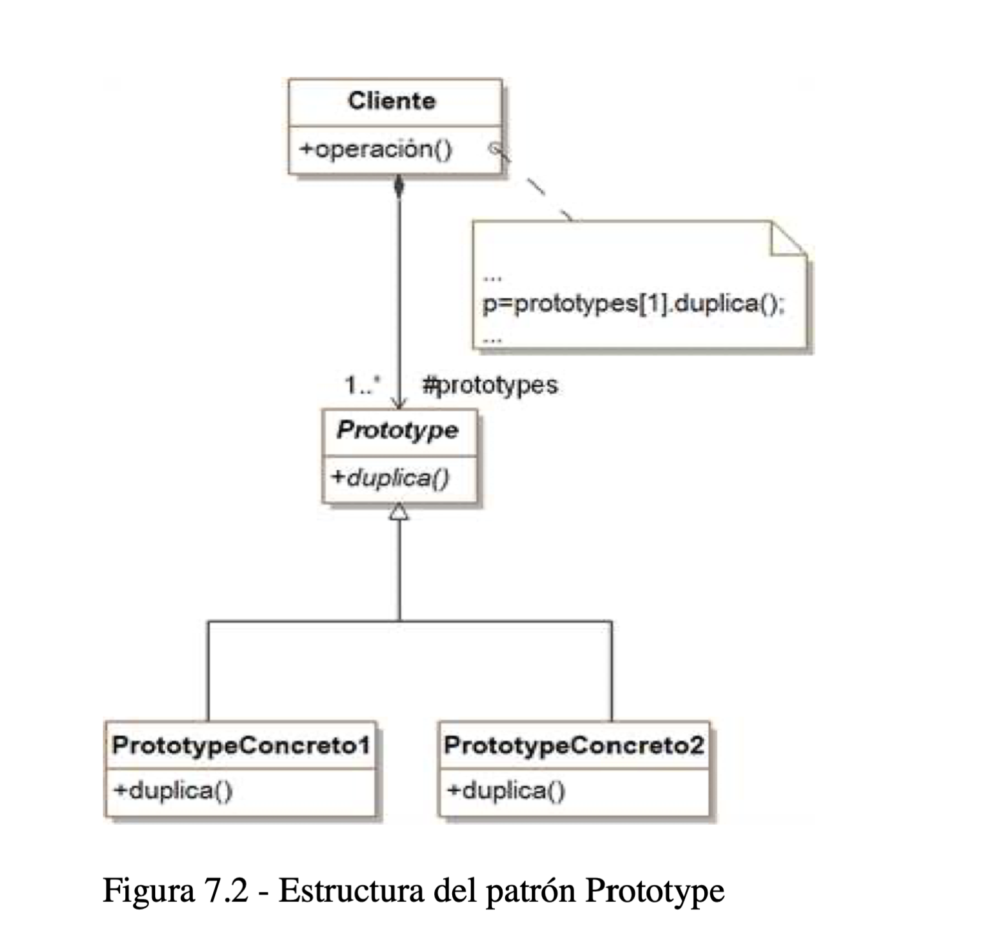
* [Singleton]
  * asegura que una clase sólo tenga una instancia y proporciona un punto de acceso global a ella.
  * un caso de uso común de este patrón es cuando se necesita controlar el acceso a un recurso compartido, como un archivo o una base de datos.
    * 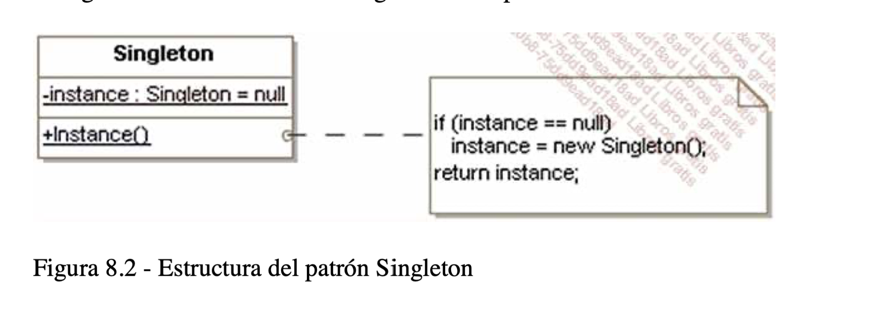
## Structural patterns
### los patrones estructurales se centran en cómo se componen los objetos y clases, tratando de optimizar la estructura general del software.
* [Adapter]
  * convierte la interfaz de una clase en otra interfaz que los clientes esperan. Adapter permite que clases trabajen juntas que de otra forma no podrían debido a interfaces incompatibles.
  * un caso de uso común de este patrón es cuando se necesita utilizar una clase existente, pero su interfaz no es compatible con el resto del código.
  * 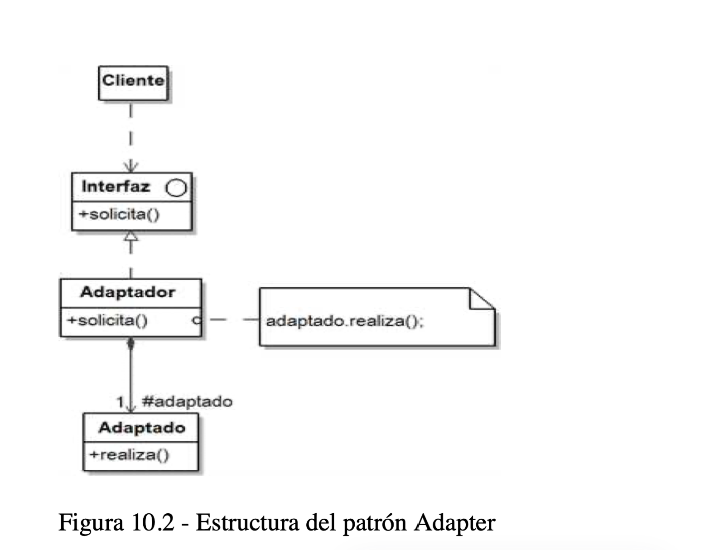
* [Bridge]
  * separa una abstracción de su implementación para que las dos puedan variar independientemente.
  * un caso de uso común de este patrón es cuando se necesita extender una clase en varias dimensiones independientes.
  * 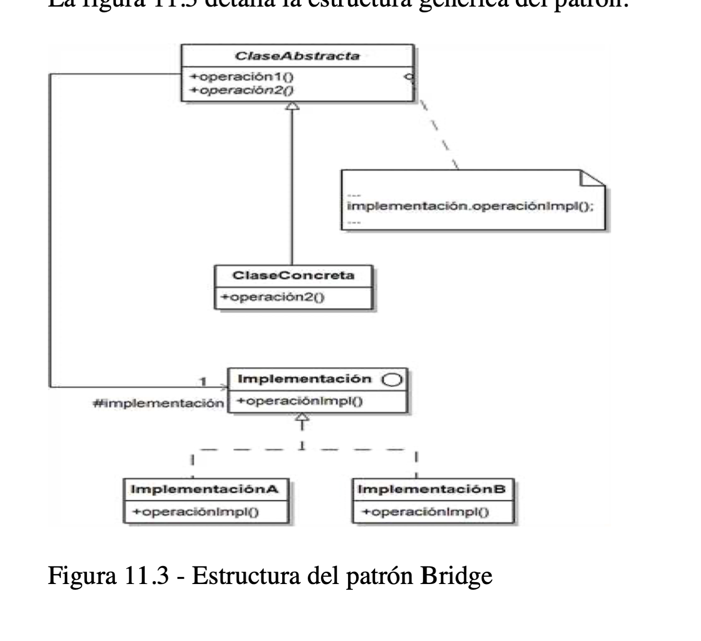
* [Composite]
  * permite a los clientes tratar a objetos individuales y composiciones de objetos de forma uniforme.
  * un caso de uso común de este patrón es un árbol de objetos en el que cada nodo puede ser un objeto simple u otra composición.
  * 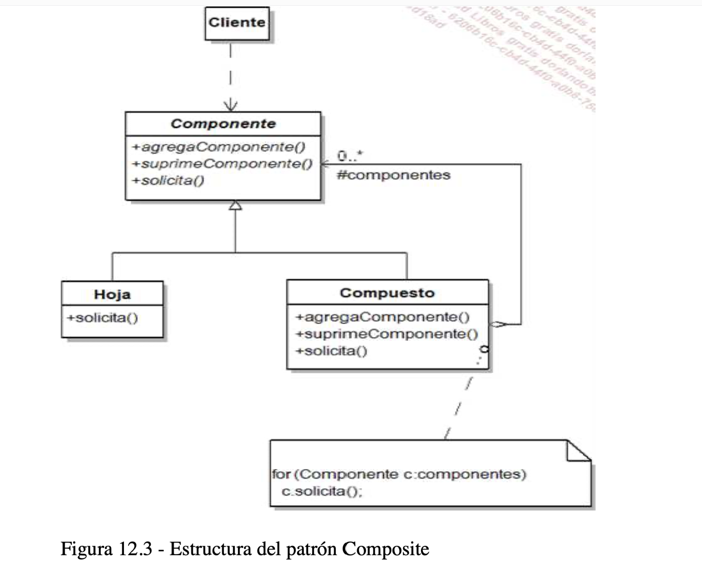
* [Decorator]
  * añade dinámicamente nuevas responsabilidades a un objeto. Decorator proporciona una alternativa flexible a la herencia para extender la funcionalidad.
  * un caso de uso común de este patrón es cuando se necesita añadir responsabilidades a objetos individuales dinámicamente y transparentemente, sin afectar a otros objetos.
  * 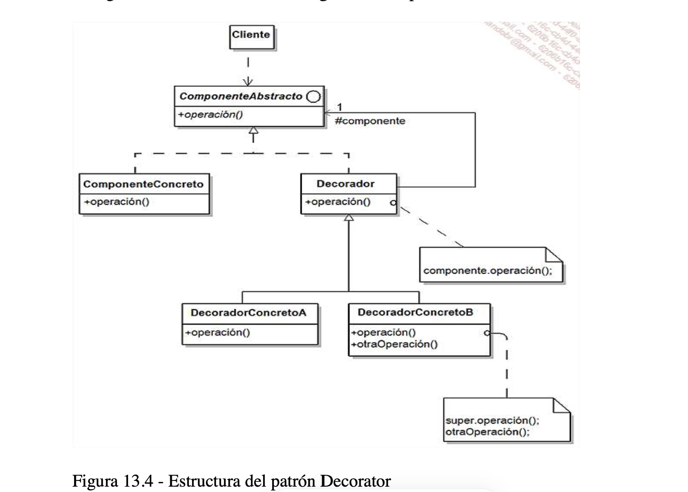
* [Facade]
  * proporciona una interfaz unificada a un conjunto de interfaces en un subsistema. Facade define una interfaz de alto nivel que hace el subsistema más fácil de usar.
  * un caso de uso común de este patrón es cuando se necesita proporcionar una interfaz simplificada a una funcionalidad compleja de un subsistema.
  * 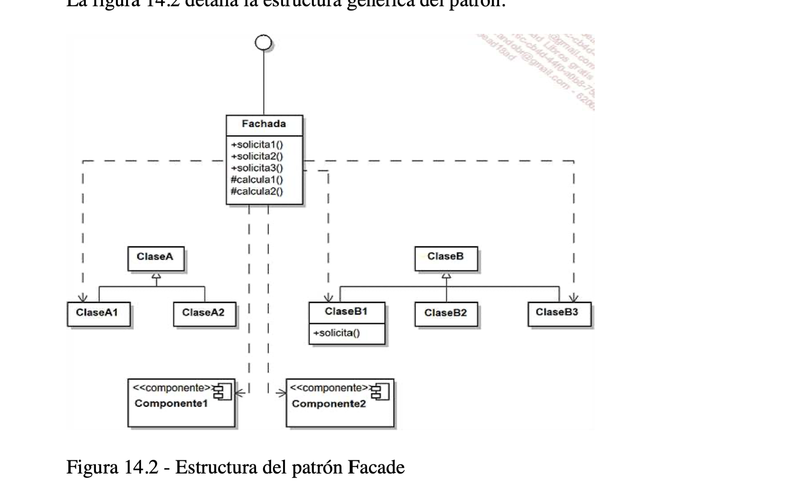
* [Flyweight]
  * usa compartición para apoyar grandes cantidades de objetos de gran detalle de forma eficiente.
  * un caso de uso común de este patrón es cuando se necesita representar una gran cantidad de objetos de gran detalle.
  * 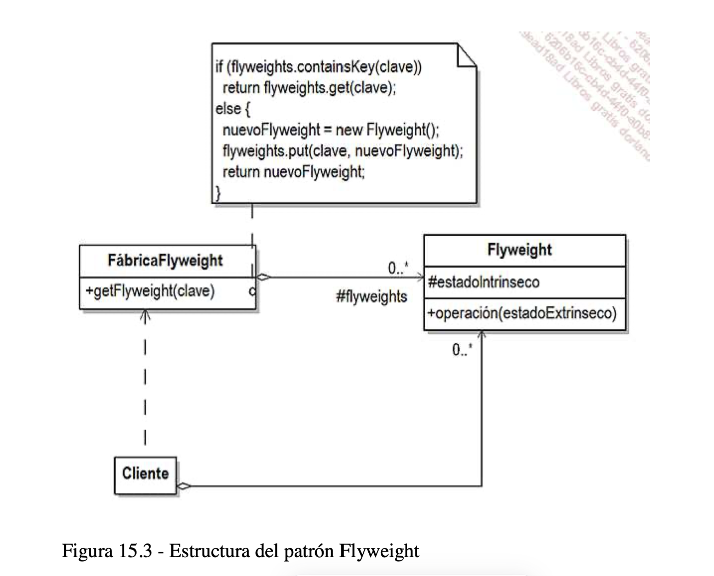
* [Proxy]
  * proporciona un sustituto o marcador de posición de otro objeto para controlar el acceso a él.
  * un caso de uso común de este patrón es cuando se necesita controlar el acceso a un objeto, ya sea para reducir el coste de acceso o para retrasar la creación de un objeto costoso hasta el momento en que sea necesario.
  * 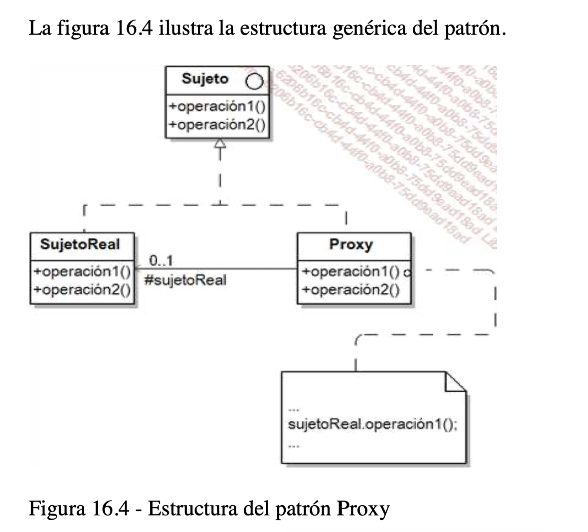

## Behavioral patterns
### los patrones de comportamiento se centran en las comunicaciones entre los objetos y cómo se distribuyen las responsabilidades entre ellos.
* [Chain of Responsibility]
* [Command]
  * encapsula una solicitud como un objeto, lo que permite parametrizar otros objetos con diferentes solicitudes, colas o registros de solicitudes y soporta operaciones que pueden deshacerse.
* [Interpreter]
* [Iterator]
* [Mediator]
* [Memento]
* [Observer]
* [State]
* [Strategy]
* [Template Method]
* [Visitor]

## Propósito de los patrones de diseño (GoF)
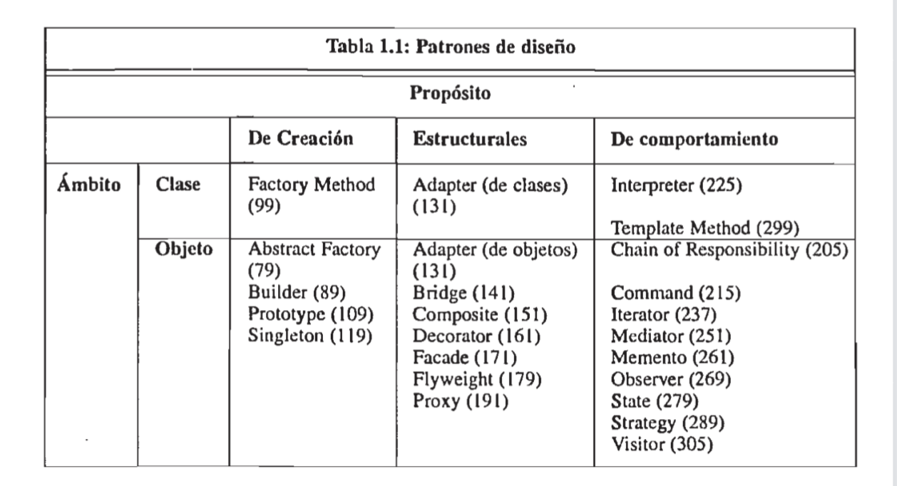
## Relations between design patterns
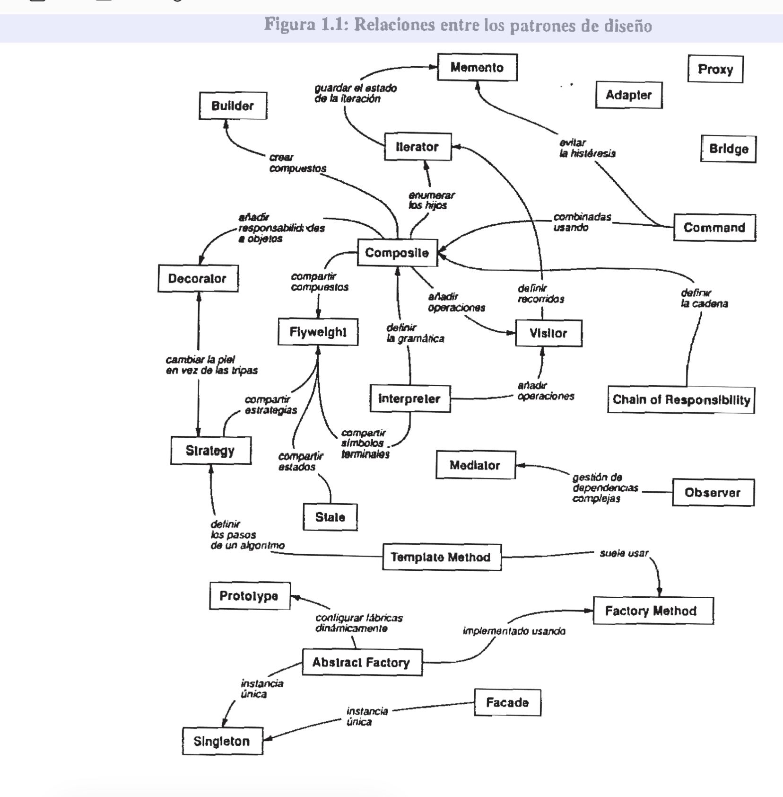