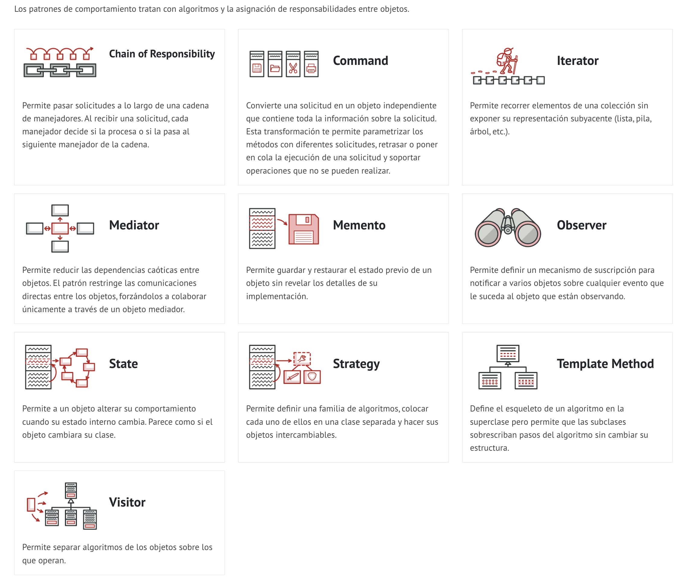

# Principles of Software Design
SOLID es un acrónimo que representa cinco principios fundamentales de diseño de software orientado a objetos. Estos principios fueron definidos por Robert C. Martin (también conocido como "Uncle Bob") y se utilizan para crear un diseño de software robusto, mantenible y escalable. Aquí están los cinco principios de SOLID:

* Principio de Responsabilidad Única (Single Responsibility Principle - SRP)
* Principio de Abierto/Cerrado (Open/Closed Principle - OCP)
* Principio de Sustitución de Liskov (Liskov Substitution Principle - LSP)
* Principio de Segregación de Interfaces (Interface Segregation Principle - ISP)
* Principio de Inversión de Dependencias (Dependency Inversion Principle - DIP)
## S—>El Principio de Responsabilidad Única (SRP)
  * Este principio establece que una clase debería tener solo una responsabilidad única, es decir, solo debe haber una razón para que una clase cambie. Si una clase tiene más de una responsabilidad, puede ser difícil de mantener y extender. En resumen, una clase debe hacer solo una cosa y hacerla bien.
## O—>El Principio de Abierto/Cerrado (OCP)
  * Este principio establece que una clase debería estar abierta para extensión pero cerrada para modificación. Es decir, se debería poder extender una clase para agregar nuevas funcionalidades sin cambiar el código existente. Esto se puede lograr mediante el uso de patrones de diseño como el patrón de estrategia y el patrón de decorador.
## L—>El Principio de Sustitución de Liskov (LSP)
  * Este principio establece que una instancia de una subclase debería poder ser usada en lugar de una instancia de su clase base sin afectar la corrección del programa. En otras palabras, las subclases no deben alterar el comportamiento de las clases base. Si no se cumple este principio, puede dar lugar a comportamientos inesperados y errores en el programa.
## I—>El Principio de Segregación de Interfaces (ISP)
  * Este principio establece que una clase no debe depender de interfaces que no utiliza. Es decir, las interfaces deben ser pequeñas y específicas para cada función y no deben tener más métodos de los necesarios. Si una clase implementa una interfaz con métodos que no utiliza, puede ser difícil de mantener y extender.
## D—>El Principio de Inversión de Dependencia (DIP)
  * Los módulos de alto nivel no deberían depender de módulos de bajo nivel, ambos deberían depender de abstracciones; las abstracciones no deberían depender de los detalles, sino los detalles deberían depender de las abstracciones.

# Design Patterns
## Creational patterns 
### los patrones de creación se centran en la forma de crear objetos y cómo estos objetos se relacionan entre sí y con el entorno.

* [Abstract Factory]
  * proporciona una interfaz para crear familias de objetos relacionados o dependientes sin especificar sus clases concretas.
  * un caso de uso común de este patrón es cuando una aplicación debe crear una familia de objetos relacionados, pero no sabe de antemano qué clases concretas necesitará.
  
  * Veamos un ejemplo. Supongamos que estamos desarrollando un videojuego de rol (RPG) y queremos crear una fábrica para crear personajes, monstruos y objetos relacionados con el juego. En lugar de crear una clase para cada objeto, podemos utilizar el patrón Abstract Factory para crear una fábrica abstracta que produzca diferentes tipos de personajes, monstruos y objetos
* [Builder]
  * separa la construcción de un objeto complejo de su representación para que el mismo proceso de construcción pueda crear diferentes representaciones.
  * un caso de uso común de este patrón es cuando un algoritmo debe crear diferentes representaciones de un objeto, dependiendo de cómo se construya el objeto.
  
* [Factory Method]
  * define una interfaz para crear un objeto, pero deja a las subclases decidir qué clase instanciar. Factory Method permite que una clase delegue la instancianciación a subclases.
  * un caso de uso común de este patrón es cuando una clase no puede anticipar la clase de los objetos que debe crear.
  * 
* [Prototype]
  * especifica los tipos de objetos a crear usando una instancia prototípica y crea nuevos objetos copiando este prototipo.
  * un caso de uso común de este patrón es cuando la instancia de la clase a crear es demasiado compleja o costosa para ser clonada.
  * 
* [Singleton]
  * asegura que una clase sólo tenga una instancia y proporciona un punto de acceso global a ella.
  * un caso de uso común de este patrón es cuando se necesita controlar el acceso a un recurso compartido, como un archivo o una base de datos.
    * 
## Structural patterns
### los patrones estructurales se centran en cómo se componen los objetos y clases, tratando de optimizar la estructura general del software.

* [Adapter]
  * convierte la interfaz de una clase en otra interfaz que los clientes esperan. Adapter permite que clases trabajen juntas que de otra forma no podrían debido a interfaces incompatibles.
  * un caso de uso común de este patrón es cuando se necesita utilizar una clase existente, pero su interfaz no es compatible con el resto del código.
  
  * Supongamos que tenemos una clase que representa a un robot, con un método move() que mueve el robot hacia adelante. También tenemos una interfaz Moveable que define un método moveForward(). Pero el robot no implementa la interfaz Moveable. En lugar de hacer que el robot implemente la interfaz Moveable, podemos crear un adaptador para convertir la interfaz del robot en la interfaz Moveable
* [Bridge]
  * separa una abstracción de su implementación para que las dos puedan variar independientemente.
  * un caso de uso común de este patrón es cuando se necesita extender una clase en varias dimensiones independientes.
  * 
  * Un ejemplo común de uso del patrón Bridge es en la creación de formas de dibujo en un programa de dibujo. La abstracción define la forma, mientras que la implementación define cómo se dibuja la forma. El puente conecta ambas partes y permite a las formas y a la implementación variar de forma independiente.
* [Composite]
  * permite a los clientes tratar a objetos individuales y composiciones de objetos de forma uniforme.
  * un caso de uso común de este patrón es un árbol de objetos en el que cada nodo puede ser un objeto simple u otra composición.
  * 
* [Decorator]
  * añade dinámicamente nuevas responsabilidades a un objeto. Decorator proporciona una alternativa flexible a la herencia para extender la funcionalidad.
  * un caso de uso común de este patrón es cuando se necesita añadir responsabilidades a objetos individuales dinámicamente y transparentemente, sin afectar a otros objetos.
  * 
* [Facade]
  * proporciona una interfaz unificada a un conjunto de interfaces en un subsistema. Facade define una interfaz de alto nivel que hace el subsistema más fácil de usar.
  * un caso de uso común de este patrón es cuando se necesita proporcionar una interfaz simplificada a una funcionalidad compleja de un subsistema.
  * 
* [Flyweight]
  * usa compartición para apoyar grandes cantidades de objetos de gran detalle de forma eficiente.
  * un caso de uso común de este patrón es cuando se necesita representar una gran cantidad de objetos de gran detalle.
  * 
* [Proxy]
  * proporciona un sustituto o marcador de posición de otro objeto para controlar el acceso a él.
  * un caso de uso común de este patrón es cuando se necesita controlar el acceso a un objeto, ya sea para reducir el coste de acceso o para retrasar la creación de un objeto costoso hasta el momento en que sea necesario.
  * 

## Behavioral patterns
### los patrones de comportamiento se centran en las comunicaciones entre los objetos y cómo se distribuyen las responsabilidades entre ellos.

* [Chain of Responsibility]
  * evita acoplar el remitente de una solicitud a su receptor al dar a más de un objeto la oportunidad de manejar la solicitud. Encadena los objetos receptores y pasa la solicitud a lo largo de la cadena hasta que un objeto la maneja.
  * un caso de uso común de este patrón es cuando se necesita que más de un objeto pueda manejar una solicitud, y el manejador no se conoce de antemano, el manejador debe ser decidido dinámicamente.
  * 
* [Command]
  * encapsula una solicitud como un objeto, lo que permite parametrizar otros objetos con diferentes solicitudes, colas o registros de solicitudes y soporta operaciones que pueden deshacerse.
  * un caso de uso común de este patrón es cuando se necesita parametrizar objetos con operaciones.
  * 
* [Interpreter]
  * dada una lengua, define una representación para su gramática junto con un intérprete que usa la representación para interpretar sentencias en la lengua.
  * un caso de uso común de este patrón es cuando se necesita interpretar lenguajes, por ejemplo, expresiones aritméticas.
  * 
* [Iterator]
  * proporciona un modo de acceder secuencialmente a los elementos de un objeto agregado sin exponer su representación subyacente.
  * un caso de uso común de este patrón es cuando se necesita acceder a un objeto agregado, pero no se sabe o no importa sus representaciones subyacentes.
  * 
* [Mediator]
  * define un objeto que encapsula la forma en que un conjunto de objetos interactúa. Mediator promueve el acoplamiento débil al evitar que los objetos se refieran explícitamente unos a otros y permite variar sus interacciones independientemente.
  * un caso de uso común de este patrón es cuando se necesita variar las interacciones entre objetos de forma independiente.
  * 
* [Memento]
  * sin violar el encapsulamiento, captura y externaliza un estado interno de un objeto, de forma que el objeto pueda ser restaurado a este estado más tarde.
  * un caso de uso común de este patrón es cuando se necesita capturar y restaurar el estado interno de un objeto sin violar su encapsulamiento.
  * 
* [Observer]
  * define una dependencia de uno a muchos entre objetos de modo que cuando un objeto cambia de estado, todos sus dependientes son notificados y actualizados automáticamente.
  * un caso de uso común de este patrón es cuando se necesita notificar a varios objetos sobre cualquier cambio de estado o evento que ocurra en otro objeto.
  * 
* [State]
  * permite a un objeto alterar su comportamiento cuando su estado interno cambia. El objeto parecerá cambiar de clase.
  * un caso de uso común de este patrón es cuando un objeto debe cambiar su comportamiento en función de su estado interno, y el número de estados es grande o desconocido.
  * 
* [Strategy]
  * define una familia de algoritmos, encapsula cada uno de ellos y los hace intercambiables. Strategy permite que el algoritmo varíe independientemente de los clientes que lo usan.
  * un caso de uso común de este patrón es cuando se necesita usar diferentes algoritmos en diferentes situaciones, y se sabe que estos algoritmos pueden cambiar a lo largo del tiempo.
  * 
* [Template Method]
  * define el esqueleto de un algoritmo en una operación, retrasando algunos pasos a las subclases. Template Method permite que las subclases redefinan ciertos pasos de un algoritmo sin cambiar la estructura del mismo.
  * un caso de uso común de este patrón es cuando se necesita definir el esqueleto de un algoritmo en una operación, definiendo ciertos pasos pero dejando otros para que sean implementados por las subclases.
  * 
* [Visitor]
  * representa una operación a realizar sobre los elementos de un objeto estructural. Visitor permite definir una nueva operación sin cambiar las clases de los elementos sobre los que opera.
  * un caso de uso común de este patrón es cuando se necesita definir una nueva operación sobre los elementos de un objeto estructural sin cambiar las clases de los elementos.
  * 

## Propósito de los patrones de diseño (GoF)

## Relations between design patterns

## Analogias de los patrones de diseño
### Patrones creacionales:
* Singleton: una caja registradora de una tienda que debe ser única en todo el establecimiento.
* Factory Method: una fábrica de chocolates que produce diferentes tipos de chocolates con los mismos ingredientes básicos.
* Abstract Factory: una fábrica de muebles que produce diferentes tipos de muebles (sillas, mesas, etc.) con diferentes materiales (madera, metal, etc.).
* Builder: un menú personalizado en un restaurante donde el cliente elige los ingredientes para su comida.
* Prototype: un catálogo de prendas de ropa donde los clientes pueden ver diferentes combinaciones de ropa.
### Patrones estructurales:
* Adapter: un enchufe que convierte la energía eléctrica de una toma de corriente de un país en la toma de corriente de otro país.
* Bridge: un control remoto que permite a los usuarios controlar diferentes dispositivos electrónicos en su hogar.
* Composite: un árbol genealógico donde cada nodo puede tener hijos y padres, formando una estructura jerárquica.
* Decorator: un pastel decorado con diferentes coberturas, como frutas, flores o dulces.
* Facade: un cajero automático que oculta la complejidad de las operaciones bancarias para el usuario.
* Flyweight: una impresora que utiliza el mismo patrón para imprimir múltiples documentos.
* Proxy: un servidor proxy que actúa como intermediario entre el cliente y el servidor de destino.
### Patrones de comportamiento:
* Chain of Responsibility: un sistema de atención al cliente donde las quejas se manejan a través de múltiples niveles de autoridad.
* Command: un control remoto de televisión que envía diferentes comandos a la televisión según la tecla que se presione.
* Interpreter: una calculadora que interpreta y resuelve diferentes expresiones matemáticas.
* Iterator: una lista de tareas donde el usuario puede avanzar y retroceder entre diferentes elementos de la lista.
* Mediator: un chat en línea donde los usuarios se comunican a través de un mediador central.
* Memento: un editor de texto que permite deshacer y rehacer las acciones del usuario.
* Observer: una suscripción a una revista que notifica al suscriptor cada vez que se publica un nuevo número.
* State: un reproductor de música que cambia su estado (reproduciendo, en pausa, detenido) según la interacción del usuario.
* Strategy: una aplicación de edición de imágenes que permite al usuario seleccionar diferentes estrategias de edición para una misma imagen.
* Template Method: un formulario en línea que sigue la misma estructura, pero tiene diferentes campos de información según el tipo de formulario que se está llenando.
* Visitor: una aplicación que analiza diferentes tipos de archivos y los procesa según su tipo.