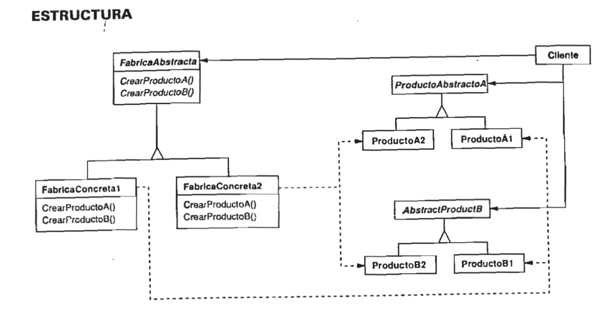

# Abstract Factory
## Participantes
* AbstractFactory
* ConcreteFactory
* AbstractProduct
* ConcreteProduct
* Client
## Diagrama

## Colaboraciones
* Client solicita a AbstractFactory la creación de un AbstractProduct.
* AbstractFactory crea un ConcreteProduct.
* Client usa el ConcreteProduct.