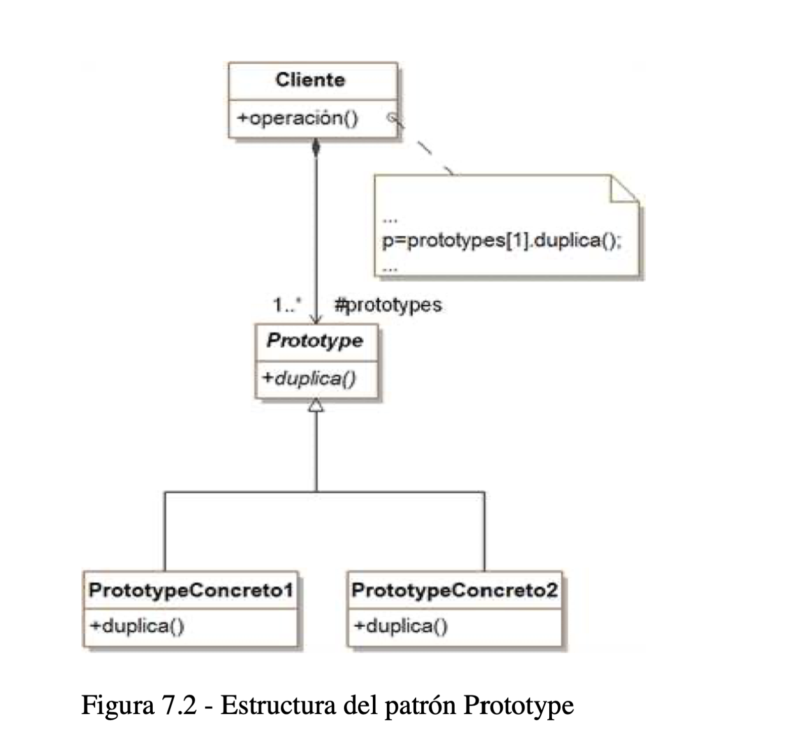

# Prototype
## Participantes
* Prototype 
* ConcretePrototype
* Client

## Descripcion

* El patrón Prototype es un patrón de creación que permite la clonación de objetos, incluso los complejos, sin acoplar su código a sus clases específicas.

## Diagrama
