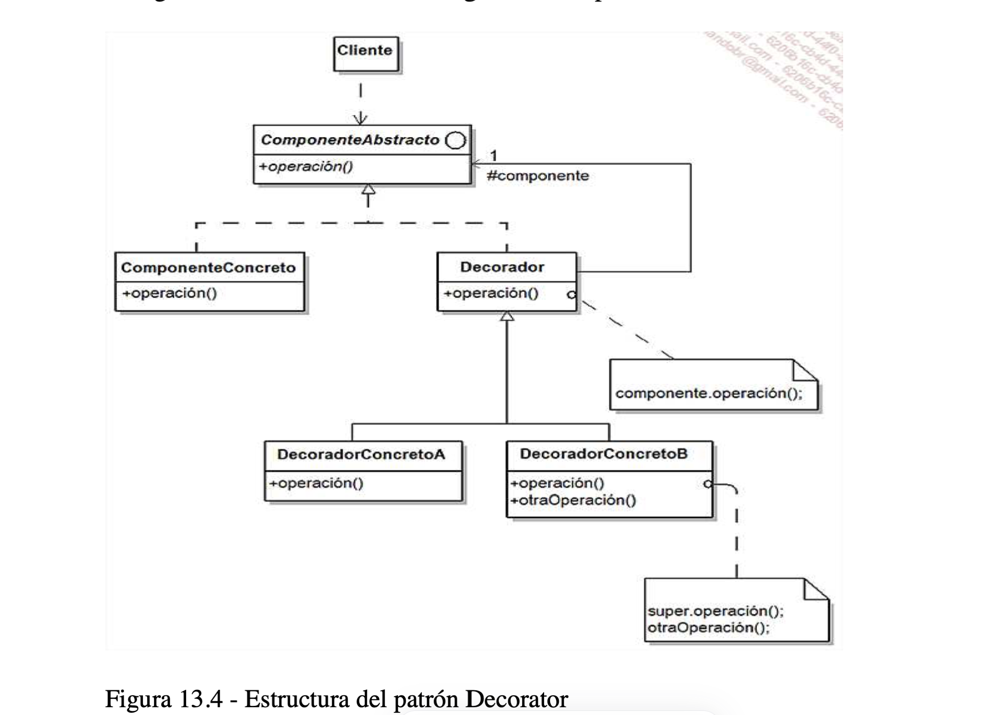

# Decorator
## participantes
* Component
* ConcreteComponent
* Decorator
* ConcreteDecorator
* Client

# Descripcion
* EL patrón Decorator permite agregar responsabilidades a un objeto dinámicamente. Ofrece una alternativa flexible a la herencia para extender la funcionalidad.

## Diagrama
